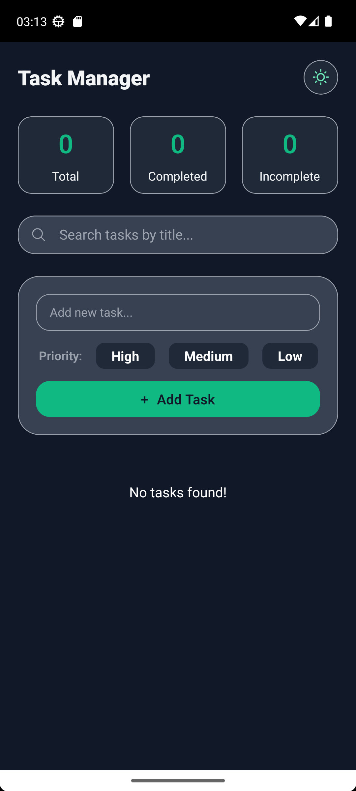
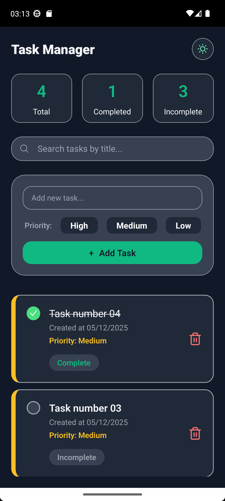

# Task List App

A modern task management application built with React Native and Expo, providing an intuitive experience for managing your daily tasks.

## Overview

This application demonstrates a complete implementation of a task list with persistent storage, theme customization, and a component-based architecture. It serves as both a practical tool and a reference implementation for React Native best practices.

<p align="center">
  
  &nbsp; &nbsp; &nbsp; &nbsp;
  
</p>

## Features

### Task Management

- **Full CRUD Operations:** Create, read, update, and delete tasks with a clean interface
- **Persistent Storage:** Tasks are saved locally using Async Storage and persist across app sessions
- **Search Functionality:** Real-time search to quickly find specific tasks
- **Task Completion:** Mark tasks as complete and track your progress

### User Interface

- **Light and Dark Themes:** Switch between color schemes for optimal viewing comfort
- **Responsive Design:** Adapts to different screen sizes
- **Toast Notifications:** Visual feedback for user actions

### Architecture

- **Component-Based Design:** Modular, reusable components for better maintainability
- **Context API Integration:** Global state management for theme preferences
- **TypeScript Support:** Type-safe code for improved reliability and developer experience

## Tech Stack

- **[React Native](https://reactnative.dev/)** - Cross-platform mobile framework
- **[Expo](https://expo.dev/)** - Development platform and tooling
- **[TypeScript](https://www.typescriptlang.org/)** - Static typing for JavaScript
- **[Expo Router](https://docs.expo.dev/router/introduction/)** - File-based routing system
- **[Async Storage](https://react-native-async-storage.github.io/2.0/)** - Local data persistence
- **[React Native Toast Message](https://github.com/calintamas/react-native-toast-message)** - Toast notifications

## Getting Started

To get a local copy up and running, follow these simple steps.

### Prerequisites

Ensure you have the following installed:

- **Node.js** (v16 or higher)
- **npm** or **yarn**
- **Expo CLI**

### Installation

1.  Clone the repository

2.  Install NPM packages
    ```sh
    npm install
    ```
    or
    ```sh
    yarn install
    ```
3.  Start the development server

```sh
npx expo start
```

4. Run on your device or emulator

- Press `i` for iOS simulator
- Press `a` for Android emulator
- Scan QR code with Expo Go app on your physical device

## Project Structure

```
/
├── src/
│   ├── app/            # Application screens and routes
│   ├── components/     # Reusable UI components
│   ├── contexts/       # React Context providers
│   └── lib/            # Shared libraries, functions, and hooks
│       ├── constants/  # App constants (e.g., colors)
│       ├── functions/  # Helper functions
│       └── hooks/      # Custom React hooks
├── assets/             # Images, fonts, and other static assets
├── app.json            # Expo configuration file
├── package.json        # Project dependencies and scripts
└── tsconfig.json       # TypeScript configuration
```

## Usage

### Adding a Task

1. Tap the "Add Task" button
2. Enter your task description
3. Press "Save" to add it to your list

### Completing a Task

Tap the checkbox next to any task to mark it as complete

### Searching Tasks

Use the search bar at the top to filter tasks by keyword

### Changing Theme

Access the settings menu to toggle between light and dark modes

## License

Distributed under the MIT License. See `LICENSE` for more information.
